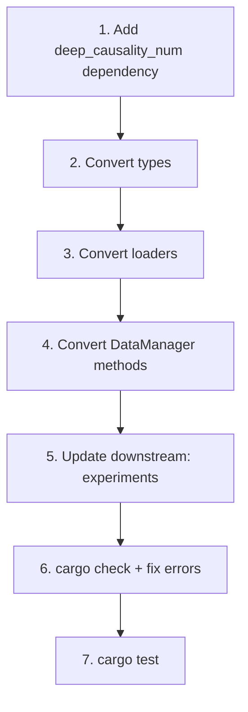

# Generic DataManager Specification

## Goal

**Complete rip-and-replace** of `data_manager` crate: convert ALL types and ALL data loaders from `f64` to generic
`R: RealField`. No backward compatibility. All downstream consumers must be updated to use `R: RealField`.

---

## Scope

### Types to Convert

| File                      | Types                                                                          | Current | Target         |
|---------------------------|--------------------------------------------------------------------------------|---------|----------------|
| `clock_types.rs`          | `ClockData`                                                                    | f64     | `ClockData<R>` |
| `orbit_types.rs`          | `OrbitData`                                                                    | f64     | `OrbitData<R>` |
| `interferometry_types.rs` | `RamanShot`, `EinsteinElevatorData`, `ActionPhaseResults`                      | f64     | Generic        |
| `mhd_types.rs`            | `OmniRecord`                                                                   | f64     | Generic        |
| `pta_types.rs`            | `PulsarObservation`                                                            | f64     | Generic        |
| `sparc_types.rs`          | `RotationCurvePoint`, `GalaxyRotationCurve`, `GalaxyProperties`, `SparcGalaxy` | f64     | Generic        |
| `strong_gravity_types.rs` | All types                                                                      | f64     | Generic        |

### Loaders to Convert

| File                     | Function                    | Current          | Target              |
|--------------------------|-----------------------------|------------------|---------------------|
| `load_clk.rs`            | `parse_clk()`               | `Vec<ClockData>` | `Vec<ClockData<R>>` |
| `load_sp3.rs`            | `parse_sp3()`               | `Vec<OrbitData>` | `Vec<OrbitData<R>>` |
| `load_data.rs`           | `load_data()`               | f64 types        | Generic             |
| `load_all_satellites.rs` | `load_all_satellites()`     | f64 types        | Generic             |
| `load_inferometer.rs`    | All loaders                 | f64 types        | Generic             |
| `load_mhd.rs`            | `load_omni_data()`          | f64 types        | Generic             |
| `load_pta.rs`            | All loaders                 | f64 types        | Generic             |
| `load_pulsar.rs`         | All loaders                 | f64 types        | Generic             |
| `load_sparc.rs`          | All loaders                 | f64 types        | Generic             |
| `load_g_values.rs`       | `load_gm_values_from_csv()` | `Vec<f64>`       | `Vec<R>`            |

---

## Proposed Changes

### Pattern: Generic Type with From<f64> Conversion

All types follow this pattern:

```rust
use deep_causality_num::RealField;

#[derive(Debug, Clone)]
pub struct ClockData<R: RealField> {
    timestamp: NaiveDateTime,
    sat_id: SatId,
    bias_s: R,
}

impl<R: RealField> ClockData<R> {
    pub fn new(timestamp: NaiveDateTime, sat_id: SatId, bias_s: R) -> Self {
        Self { timestamp, sat_id, bias_s }
    }

    pub fn timestamp(&self) -> NaiveDateTime { self.timestamp }
    pub fn sat_id(&self) -> SatId { self.sat_id }
    pub fn bias_s(&self) -> R where
        R: Clone
    { self.bias_s.clone() }
}
```

### Pattern: Generic Loader with Conversion at Parse

```rust
pub fn parse_clk<R, P>(path: P, sat_id: &str) -> io::Result<Vec<ClockData<R>>>
where
    R: RealField + From<f64>,
    P: AsRef<Path>,
{
    // Parse line as f64, convert immediately to R
    let bias_f64: f64 = fields[2].parse().unwrap();
    let bias: R = R::from(bias_f64);

    Ok(ClockData::new(timestamp, sat_id, bias))
}
```

### DataManager API

```rust
impl DataManager {
    pub fn load_gnss_single_satellite<R, P>(
        &self,
        clk_path: P,
        sp3_path: P,
        sat_id: &str,
    ) -> io::Result<(Vec<ClockData<R>>, Vec<OrbitData<R>>)>
    where
        R: RealField + From<f64>,
        P: AsRef<Path>;
}
```

---

## Downstream Updates Required

### `experiments` crate

Update all usages of `ClockData`, `OrbitData` to specify type parameter:

```rust
// Before
let clocks: Vec<ClockData> = dm.load_gnss_clock_data(...) ?;

// After
let clocks: Vec<ClockData<FloatType> > = dm.load_gnss_clock_data(...) ?;
```

### `E00_chrono_mass/main.rs`

Already uses `FloatType` pattern — just needs type annotations on data loading calls.

---

## File Summary

| Action | Path                                 | Est. Changes                    |
|--------|--------------------------------------|---------------------------------|
| MODIFY | `types/clock_types.rs`               | Add `<R: RealField>`            |
| MODIFY | `types/orbit_types.rs`               | Add `<R: RealField>`            |
| MODIFY | `types/interferometry_types.rs`      | Add `<R: RealField>` to 3 types |
| MODIFY | `types/mhd_types.rs`                 | Add `<R: RealField>`            |
| MODIFY | `types/pta_types.rs`                 | Add `<R: RealField>`            |
| MODIFY | `types/sparc_types.rs`               | Add `<R: RealField>` to 4 types |
| MODIFY | `types/strong_gravity_types.rs`      | Add `<R: RealField>`            |
| MODIFY | `data_loader/load_clk.rs`            | Generic parser                  |
| MODIFY | `data_loader/load_sp3.rs`            | Generic parser                  |
| MODIFY | `data_loader/load_data.rs`           | Generic wrapper                 |
| MODIFY | `data_loader/load_all_satellites.rs` | Generic loader                  |
| MODIFY | `data_loader/load_inferometer.rs`    | Generic loaders                 |
| MODIFY | `data_loader/load_mhd.rs`            | Generic loader                  |
| MODIFY | `data_loader/load_pta.rs`            | Generic loaders                 |
| MODIFY | `data_loader/load_pulsar.rs`         | Generic loaders                 |
| MODIFY | `data_loader/load_sparc.rs`          | Generic loaders                 |
| MODIFY | `data_loader/load_g_values.rs`       | Generic loader                  |
| MODIFY | `data_manager/mod.rs`                | All methods generic             |
| MODIFY | `lib.rs`                             | Update exports                  |

**Downstream updates**:

- `experiments/bin/E00_chrono_mass/main.rs`
- Any other binaries using data_manager

---

## Implementation Order



---

## Verification

```bash
cargo check -p data_manager
cargo check -p experiments
cargo test -p data_manager
cargo test -p experiments
cargo run --release -p experiments --bin E00_chrono_mass
```
